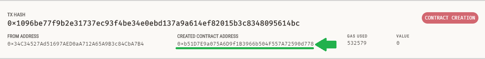

# Smart Contract Cartorio

## Objetivo
O objetivo desse repositório é substituir serviços caros, desnecessários e burocráticos por versões alternativas utilizando Smart Contracts.

## Funcionamento
Este contrato é feito em Solidity e tem algumas dependencias:
- Truffle
- Ganache
- truffle-assertions(tests)
- chai(tests)

## Como iniciar o contrato
1. Abra o Ganache
2. Abra o prompt de comando e execute:
```
truffle init
```
3. Antes de iniciar o contrato é importante ir no arquivo "2_signSimple_migration.js" e alterar o endereço de quem vai assinar o contrato (esse endereço pode ser qualquer um que tenha no ganache) e o nome do contrato.
4. Faça o deploy do contrato:
```
truffle deploy
```

## Como interagir com o contrato
Para interagir com o contrato primeiro é necessário o endereço de criação dele, é possivel encontrar esse endereço na aba "Transactions" do Ganache.

Se deu tudo certo até aqui e o espaço de trabalho da ganache é novo deve ter apenas 4 transações na aba "Transactions", duas delas devem estar marcadas como criação de contratos, sendo a primeira o contrato de migrations (que ajuda a dar deploy no nosso contrato) e o segundo (em ordem de mais antigo pra mais novo) é o nosso contrato.
- Clique nessa aba e copie o endereço de criação do contrato:



- Digite no prompt de comando:
```
truffle console
```
Esse console funciona com Javascript, então é só digitar os comando abaixo para interagir com o contrato.

- Vamos então chamar o contrato sempre por uma variavel (bote o endereço que você anotou no comando):
```js
var doc; DocumentSignSimple.at(bote_aqui_o_endereço_de_crição_do_contrato).then( function(x) { doc = x });
// Exemplo:
var doc; DocumentSignSimple.at("0x32d1603064069e5268B9D6B03C4F00991033a86F").then( function(x) { doc = x });
```

## Comandos para usar no contrato

- Faz assinatura do contrato(só permite assinar se você for o signatario certo):
```js
doc.Sign({from:endereço_do_signatario});
// Exemplo: doc.Sign({from:"0xF9011ad863FE9060C49D906FCe6AEae0Fe1BFc20"});
```

- View que checa se o nome do documento passado é igual ao nome do documento que está no contrato:
```js
doc.MatchDocument(nome_do_documento);
// Exemplo: doc.MatchDocument("doc1");
```
- View que retorna o Hash do nome do documento e se ele foi assinado ou não:
```js
doc.GetDocument();
```
-View que retorna o endereço do Signatario, se o documento foi assinado e quando foi assinado:
```js
doc.GetSignedInfo();
```

## Testes

Para rodar os testes saia do console do truffle e digite no prompt de comando:
```
truffle test
```
Os 8 testes devem funcionar.